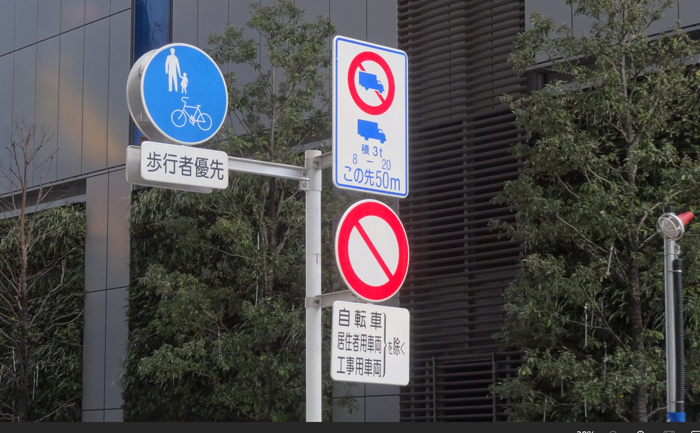

<h2> Image-Distortion-Tool</h2>

 
<h3> 
1 ImageDistorter
</h3>

This is a simple python class <a href="./ImageDistorter.py">ImageDistorter</a> to distort an image by using scipy gaussian filter and OpenCV remap.
It is based on the code in the following stackoverflow web-site. 
 
https://stackoverflow.com/questions/41703210/inverting-a-real-valued-index-grid/78031420#78031420
 
 
Distortion Example by ImageDistorter 
 

 
In this class, we use the 
<a href="https://docs.scipy.org/doc/scipy/reference/generated/scipy.ndimage.gaussian_filter.html">scipy gaussian_filter</a>
<pre>
scipy.ndimage.gaussian_filter(input, sigma, order=0, output=None, mode='reflect', cval=0.0, 
   truncate=4.0, *, radius=None, axes=None)[source]
</pre>

This ImageDistorter runs on Python 3.8 or later version. Please install opencv-python and scipy to your Python development enviroment.   
This tool will be used to augment the image and mask files to train an image segmentation model. 

<h3>
2 ImageDistorter
</h3> 
To run ImageDistorter, please specify a <i>distortion.config</i> as a command-line parameter as shown below.
<pre>
>python ImageDistorter distortion.config
</pre>
distortion.config file takes a typical ini file format. 
<pre>
[distortion]
; Image input directory
images_dir             = "./images"
; Image output directory
output_dir             = "./distorted"
gaussian_filter_rsigma = 40
gaussian_filter_sigma  = 0.5
;Specify a list of distortion rate which is less than 1.
distortions            = [0.01, 0.02, 0.03]
</pre>

<h3>
2.1 Run ImageDistorter with a distortion.config
</h3> 

Please run the following command.
<pre>
>python ImageDistorter distortion.config
</pre>
, where distortion.config is the following. 
<pre>
;distortion.config
[distortion]
images_dir             = "./images"
output_dir             = "./distorted"
gaussian_filter_rsigma = 40
gaussian_filter_sigma  = 0.5
distortions            = [0.01]
</pre>
By running the command above, each image in images_dir will be read, distorted by the parameters in [distortion] section, and
saved to output_dir. 

 
Original  
 
 
Distorted  
 

 
Enlarged sample images 
coca-cola  
 
distorted coco-cola 
 
 

cranes  
 
distorted cranes 
 

road_signs  
 
distorted road_signs 
 

<h3>
3. Seeing Is Believing
</h3> 
Please run the following command to visualize clearly the distortion effects of this tool,  
<pre>
>python ImageDistorter distortion3.config
</pre>
, where distortion.config is the following. 
<pre>
;distortion3.config
; 2024/03/30
[distortion]
images_dir             = "./meshed_images"
output_dir             = "./distorted3"
gaussian_filter_rsigma = 40
gaussian_filter_sigma  = 0.5
distortions            = [0.01, 0.02, 0.03]
</pre>
Please note that there are three elements in distortions list as shown above. 
By this example, you can easily see the distortion effects by those parameters.

 
MeshedPicture  
 
 
Distorted rate=0.01  
 
Distorted rate=0.02  
 
Distorted rate=0.03  
 

