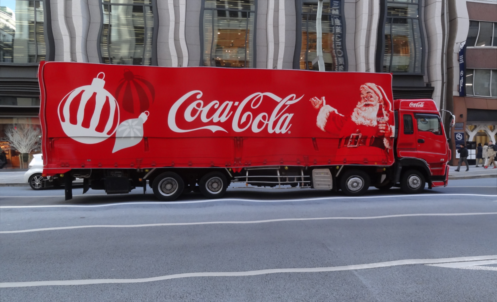
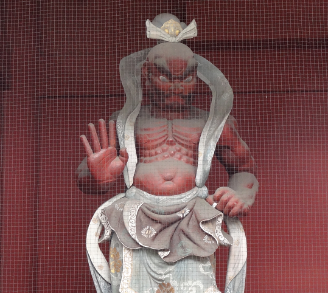
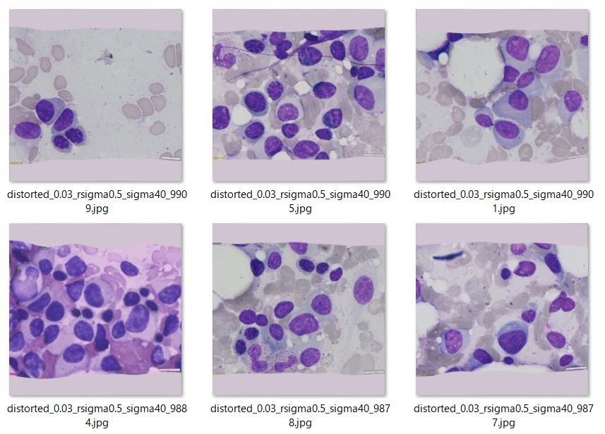

<h2> Image-Distortion-Tool (Updated: 2024/04/01)</h2>

<li>2024/04/01: Modified the output file name to be a format of "distorted_{ratio}_rsigma{rsigma}_sigma{sigma}_{origina_filename}". </li>
<li>2024/04/01: Added Distortion Example of MultipleMyeloma Dataset. </li>
 
<a href="#1">1, ImageDistorter</a> 
<a href="#2">2, Run ImageDistorter</a> 
<a href="#3">3. Seeing Is Believing</a> 
<a href="#4">4. MultipleMyeloma Dataset Distortion</a> 
 
<h3> 
<a id="1">1. ImageDistorter</a>
</h3>

This is a simple python class <a href="./ImageDistorter.py">ImageDistorter</a> to distort an image by using scipy gaussian filter and OpenCV remap.
It is based on the code in the following stackoverflow web-site. 
 
https://stackoverflow.com/questions/41703210/inverting-a-real-valued-index-grid/78031420#78031420
 
 
Distortion Example by ImageDistorter 
 

 
In this class, we use the 
<a href="https://docs.scipy.org/doc/scipy/reference/generated/scipy.ndimage.gaussian_filter.html">scipy gaussian_filter</a>
<pre>
scipy.ndimage.gaussian_filter(input, sigma, order=0, output=None, mode='reflect', cval=0.0, 
   truncate=4.0, *, radius=None, axes=None)[source]
</pre>

This ImageDistorter runs on Python 3.8 or later version. Please install opencv-python and scipy to your Python development enviroment.   
This tool can be used to augment the image and mask files to train an image segmentation model.
Please refer to <a href="#4">4. MultipleMyeloma Dataset Distortion</a>, which is a typical example of offline augmentation. 
You can use the ImageDistorter class to train a segmentation model for your online dataset augmentation tool.
Image distortion can be time-consuming when used for online dataset augmentation, which will slow down the training-speed.
 
<h3>
<a id="2">2. Run ImageDistorter</a>
</h3> 
To run ImageDistorter, please specify a <i>distortion.config</i> as a command-line parameter as shown below.
<pre>
>python ImageDistorter distortion.config
</pre>
distortion.config file takes a typical ini file format. 
<pre>
[distortion]
; Image input directory
images_dir             = "./images"
; Image output directory
output_dir             = "./distorted"
gaussian_filter_rsigma = 40
gaussian_filter_sigma  = 0.5
;Specify a list of distortion rate which is less than 1.
distortions            = [0.01, 0.02, 0.03]
</pre>

<h3>
2.1 Run ImageDistorter with a distortion.config
</h3> 

Please run the following command.
<pre>
>python ImageDistorter distortion.config
</pre>
, where distortion.config is the following. 
<pre>
;distortion.config
[distortion]
images_dir             = "./images"
output_dir             = "./distorted"
gaussian_filter_rsigma = 40
gaussian_filter_sigma  = 0.5
distortions            = [0.01]
</pre>
By running the command above, each image in images_dir will be read, distorted by the parameters in [distortion] section, and
saved to output_dir. 

 
Original  
 
 
Distorted  
 

 
Enlarged sample images 
coca-cola  
 
distorted coco-cola 
 
 
 
cranes  
 
distorted cranes 
 
 
MeshedNioh  
 
distorted MeshedNioh 
 
 
road_signs  
 
distorted road_signs 
 

<h3>
<a id="3">3. Seeing Is Believing</a>
</h3> 
Please run the following command to visualize clearly the distortion effects of this tool,  
<pre>
>python ImageDistorter distortion3.config
</pre>
, where distortion.config is the following. 
<pre>
;distortion3.config
; 2024/03/30
[distortion]
images_dir             = "./meshed_images"
output_dir             = "./distorted3"
gaussian_filter_rsigma = 40
gaussian_filter_sigma  = 0.5
distortions            = [0.01, 0.02, 0.03]
</pre>
Please note that there are three elements in distortions list as shown above. 
By this example, you can easily see the distortion effects by those parameters.

 
MeshedPicture  
 
 
Distorted rate=0.01  
 
Distorted rate=0.02  
 
Distorted rate=0.03  
 

<h3>
<a id="4">4. MultipleMyeloma Dataset Distortion</a>
</h3>

<h3>4.1 MultipleMyeloma Dataset</h3>

For a pratical dataset distortion, we have applied this tool to augment MultipleMyeloma Dataset. 
<a href="https://drive.google.com/file/d/1QiGah4_0yY-5B7s2kIZ2AjbEVu2ejB3G/view?usp=sharing">MultipleMyeloma-ImageMask-Dataset_V2_X.zip</a>
 
On that dataset, please see also <a href="https://github.com/sarah-antillia/MultipleMyeloma-ImageMask-Dataset">MultipleMyeloma-ImageMask-Dataset</a>
 
Please expand the downloaded ImageMaskDataset and place them under <b>./</b> folder to be

<pre>
./MultipleMyeloma
 ├─test
 │  ├─images
 │  └─masks
 ├─train
 │  ├─images
 │  └─masks
 └─valid
     ├─images
     └─masks
</pre>
 
Dataset statistics 
 

<h3>4.2 Distort MultipleMyeloma Dataset</h3>
Please run the following command. 
<pre>
>python ImageDistorter.py distortion_multiplemyeloma.config
</pre>
, where distortion_multiplemyeloma.config is the following.
<pre>
;distortion_multiplemyeloma.config
; 2024/04/01 (C) antillia.com
[distortion]
images_dir             = "./MultipleMyeloma/train"
output_dir             = "./Distorted-MultipleMyeloma/train"
gaussian_filter_rsigma = 40
gaussian_filter_sigma  = 0.5
distortions            = [0.02, 0.03]
</pre>
As shown above, we apply this distortion tool to the train dataset of MultipleMyeloma. 
By running the command above, the following directories will be created. 
<pre>
./Distorted-MultipleMyeloma
└─train
    ├─images
    └─masks
</pre>
Distorted images 
  
Distorted masks   
  
 

By merging the generated "./Distorted-MultipleMyeloma/train" and the original "./MultipleMyeloma" folders, we have finally created
"Distorted-MultipleMyeloma-ImageMask-Dataset". 
Statistics : 
 
 

We have uploaded this dataset to the google drive
<a href="https://drive.google.com/file/d/1uH8c9zOsglFHKhFDU697NO0Hwnb7S9X6/view?usp=sharing">Distorted-MultipleMyeloma-ImageMask-Dataset.zip</a>
 

<h3>Dataset Citation</h3>
The original dataset used here has been take from the following  web site:  
<b>SegPC-2021-dataset</b> 
SegPC-2021: Segmentation of Multiple Myeloma Plasma Cells in Microscopic Images 
<pre>
https://www.kaggle.com/datasets/sbilab/segpc2021dataset
</pre>

<b>Citation:</b> 

<pre>
Anubha Gupta, Ritu Gupta, Shiv Gehlot, Shubham Goswami, April 29, 2021, "SegPC-2021: Segmentation of Multiple Myeloma Plasma Cells 
in Microscopic Images", IEEE Dataport, doi: https://dx.doi.org/10.21227/7np1-2q42.

BibTex
@data{segpc2021,
doi = {10.21227/7np1-2q42},
url = {https://dx.doi.org/10.21227/7np1-2q42},
author = {Anubha Gupta; Ritu Gupta; Shiv Gehlot; Shubham Goswami },
publisher = {IEEE Dataport},
title = {SegPC-2021: Segmentation of Multiple Myeloma Plasma Cells in Microscopic Images},
year = {2021} }

IMPORTANT:
If you use this dataset, please cite below publications-
1. Anubha Gupta, Rahul Duggal, Shiv Gehlot, Ritu Gupta, Anvit Mangal, Lalit Kumar, Nisarg Thakkar, and Devprakash Satpathy, 
 "GCTI-SN: Geometry-Inspired Chemical and Tissue Invariant Stain Normalization of Microscopic Medical Images," 
 Medical Image Analysis, vol. 65, Oct 2020. DOI: 
 (2020 IF: 11.148)
2. Shiv Gehlot, Anubha Gupta and Ritu Gupta, 
 "EDNFC-Net: Convolutional Neural Network with Nested Feature Concatenation for Nuclei-Instance Segmentation,"
 ICASSP 2020 - 2020 IEEE International Conference on Acoustics, Speech and Signal Processing (ICASSP), 
 Barcelona, Spain, 2020, pp. 1389-1393.
3. Anubha Gupta, Pramit Mallick, Ojaswa Sharma, Ritu Gupta, and Rahul Duggal, 
 "PCSeg: Color model driven probabilistic multiphase level set based tool for plasma cell segmentation in multiple myeloma," 
 PLoS ONE 13(12): e0207908, Dec 2018. DOI: 10.1371/journal.pone.0207908

License
CC BY-NC-SA 4.0
</pre>

